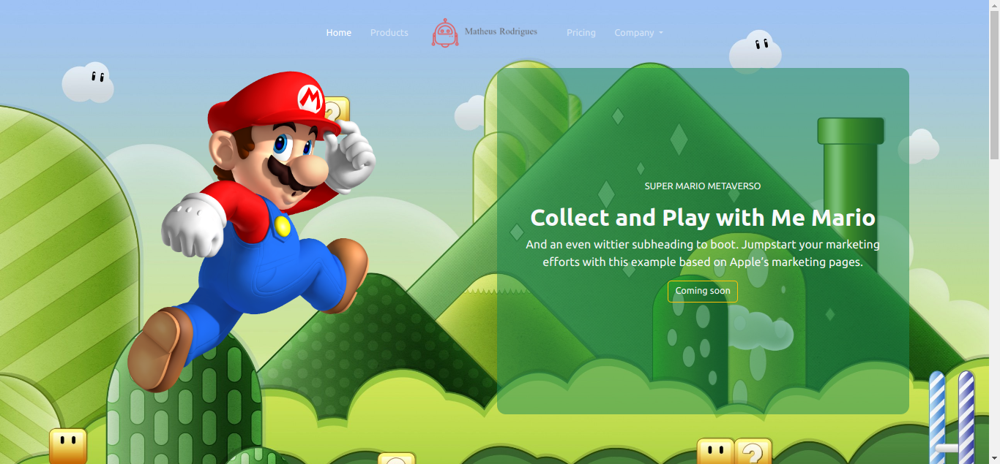

# Primeiro Projeto Bootstrap

Este projeto de landing page foi construído com o Bootstrap e inclui vários componentes, como menus de navegação, carrosséis, tabelas de preços e muito mais. O design responsivo do Bootstrap nos permitiu criar um site que funciona perfeitamente em desktops, tablets e dispositivos móveis. O uso do Bootstrap nos ajudou a economizar tempo e recursos, permitindo que nos concentrássemos em outras partes importantes da landing page.

## Screenshots

## 🔗 Você pode ver em :

